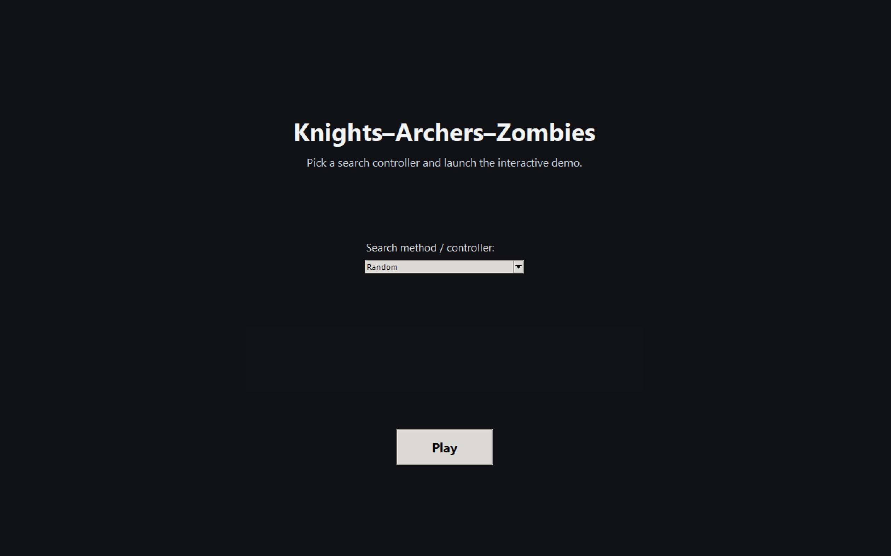
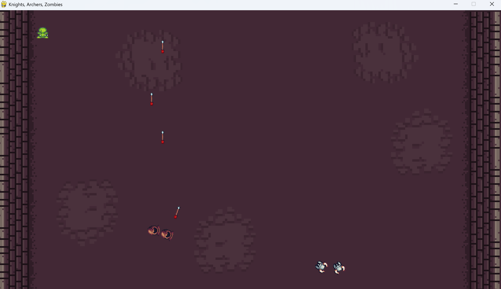

# Knights–Archers–Zombies (KAZ) Search Demo

*A cross-platform Tkinter launcher for the PettingZoo KAZ environment with pluggable search controllers*

This project provides a **full-screen launcher UI** for the **Knights–Archers–Zombies (KAZ)** environment from the [PettingZoo](https://pettingzoo.farama.org) library.
It allows users to:

* Select a search controller (Random, Greedy, DFS, BFS, A*, etc.)
* Launch the KAZ game in a **separate process** (required for macOS stability)
* View status logs during gameplay
* Play the simulation through a clean fullscreen menu

The launcher works on **Windows**, **macOS**, and **Linux**.

---

## ✨ Features

* **Fullscreen Tkinter launcher** with dark theme
* Dropdown for selecting controllers/policies
* **Play button launches KAZ in a separate process** (important for macOS; prevents `Trace/BPT trap`)
* Real-time log window showing episode progress & debug information
* Keyboard shortcuts:

  * `F11` → toggle fullscreen
  * `Esc` → exit fullscreen

---

## 🚀 Getting Started

### 1. Clone the repository

```bash
git clone https://github.com/yourusername/kaz-search-demo.git
cd kaz-search-demo
```

---

### 2. Create & activate a virtual environment

#### macOS / Linux:

```bash
python3 -m venv .venv
source .venv/bin/activate
```

#### Windows:

```powershell
python -m venv .venv
.venv\Scripts\activate
```

Your shell prompt should now show:

```
(.venv)
```

---

### 3. Install required dependencies

PettingZoo’s KAZ environment (v10) lives in the **butterfly** family and requires Gymnasium + pygame.

Install everything with:

```bash
pip install --upgrade pip
pip install "pettingzoo[butterfly]>=1.24" "gymnasium==0.29.1" "pygame==2.6.1" numpy
```

#### Why these exact versions?

| Package                       | Reason                                                       |
| ----------------------------- | ------------------------------------------------------------ |
| `pettingzoo[butterfly]>=1.24` | Provides `knights_archers_zombies_v10` in the correct module |
| `gymnasium==0.29.1`           | Version PettingZoo’s AEC API expects                         |
| `pygame==2.6.1`               | Latest stable wheel for Windows/macOS (fixes mac SDL issues) |
| `numpy`                       | Required by the environment and some controllers             |

---

### 4. Run the launcher

```bash
python kaz_launcher.py
```

This opens the full-screen menu.
Choose any controller → click **Play**.

Behind the scenes, the launcher runs the game via:

```
python kaz_launcher.py --run-game "<controller>"
```

You **do not** need to run this manually — the launcher handles it.

This design ensures:

* 🟢 Windows: works normally
* 🟢 macOS: avoids SDL/Tk conflicts (`Trace/BPT trap: 5`)
* 🟢 Linux: stable X11/Wayland behavior

---

## 🧠 Controllers

Controllers live in the `controllers/` package and follow a simple interface:

```python
action = controller(observation, action_space, agent_name, timestep)
```

Included stubs:

* Random
* Greedy Heuristic
* Depth-First Search (DFS)
* Breadth-First Search (BFS)
* Uniform-Cost / Dijkstra (stub)
* A* Search (stub)

You can easily add new controllers by creating new modules and registering them in
`controllers/__init__.py`.

---

## 🖼️ Screenshots

### Launcher Home Screen



### In-Game KAZ Environment



---

## 🔧 Technical Notes

### Why the game launches in a separate process

On macOS, launching pygame/SDL inside the same process as Tkinter often triggers:

```
Trace/BPT trap: 5
```

This comes from macOS’s requirement that GUI frameworks (Cocoa, SDL2) run on the **main thread**.

To fix this:

* The Tkinter launcher runs in the main process
* The KAZ environment runs in a **separate Python process**

This prevents all SDL/Tk collisions and works cross-platform.

---

## 📚 Learning Goals

This project aims to teach:

* How to work with **PettingZoo**’s multi-agent API
* How to adapt **search algorithms** (DFS, BFS, A*, greedy) to multi-agent game environments
* How to integrate **Tkinter UI** with external simulations
* How to build safe, cross-platform GUI pipelines using process isolation

---

## 📜 License

This project is open-source under the MIT License.
Feel free to fork, modify, and use it for coursework or research projects.

---

If you want, I can also provide:

* A polished `requirements.txt`
* A badge section for GitHub
* A CONTRIBUTING section
* A folder structure diagram

Just let me know!
